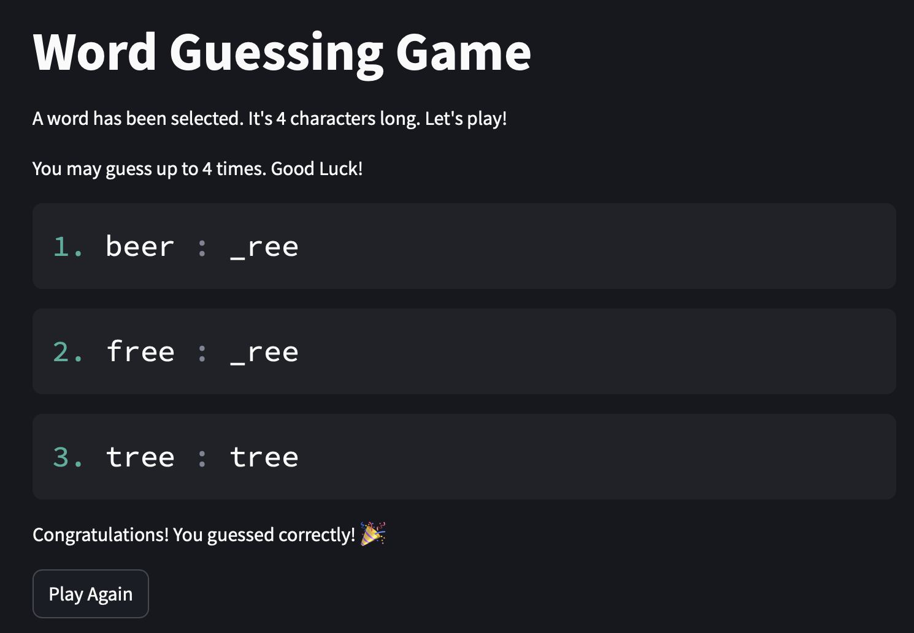

# A simple Word Guessing Game 

[](https://github.com/wolfpaulus/wordgame/actions/workflows/python-test.yml)
[](https://github.com/wolfpaulus/wordgame/actions/workflows/docker-publish.yml)
[](https://wordgame.erau.cloud)


## Overview

Implementation of a simple word-guessing game

1. **Random Word Selection**:  
    From the provided `words.txt` file a _word_  is randomly selected.

   - It is in lowercase.
   - It is 4 to 7 characters long.
   - It contains only alphabetic characters (`a-z`).

2. **Guessing**:  
   Allows the player to guess the _word_, with the number of allowed attempts equal to the length of the _word_.

3. **Initial Hint**:  
   Before the first guess, the length of the _word_ is disclosed.

4. **Feedback After Each Guess**:  
   After each guess, the following hint is provided:

   - If a guessed letter exists in the _word_, it is displayed it in the correct position(s).
   - Otherwise an underscore (`_`) is displayed
   - Example: If the _word_ is "sweet" and the _guess_ is "ethos", the feedback is `s_eet`.

5. **Handling Invalid Guesses**:  
   If the player's guess has a wrong length, it is not evaluated but still count as an attempt.

6. **Game End Conditions**:

   - If the user successfully guesses the _word_ within the allowed attempts, a congratulatory message is displayed.
   - Otherwise the correct _word_ is revealed.

7. **Replay Option**:  
   After the game ends, the player may play again.

**Example:**

```plaintext
Welcome to the word guessing game!
Try to guess the word. It's 4 characters long.
You may guess up to 4 times. Good Luck!

1. Enter your guess: pear
__re

2. Enter your guess: ware
__re

3. Enter your guess: more
__re

4. Enter your guess: wire
_ire
Sorry, you did not guess the word. The word was 'tire'.

Play again? (yes/no): 
```

**WebApp Example:**



## Deployment / CICD

The app is currently deployed on a [linux server](https://wordgame.techcasitaproductions.com) as a docker container.
The [instructions directory](./instructions/) contains more details about the deployment workflows.